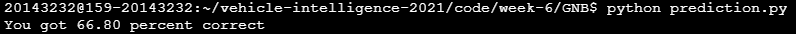

# Week 6 - Prediction & Behaviour Planning

---

## Assignment #1

Under the directory [./GNB](./GNB), you are given two Python modules:

* `prediction.py`: the main module you run. The `main()` function does two things: (1) read an input file ([`train.json`](./GNB/train.json)) and train the GNB (Gaussian Naive Bayes) classifier using the data stored in it, and (2) read another input file ([`test.json`](./GNB/test.json)) and make predictions for a number of data points. The accuracy measure is taken and displayed.
* `classifier.py`: main implementation of the GNB classifier. You shall implement two methods (`train()` and `precict()`), which are used to train the classifier and make predictions, respectively.

Both input files ([`train.json`](./GNB/train.json) and [`test.json`](./GNB/test.json)) have the same format, which is a JSON-encoded representation of training data set and test data set, respectively. The format is shown below:

```
{
	"states": [[s_1, d_1, s_dot_1, d_dot_1],
	           [s_2, d_2, s_dot_2, d_dot_2],
	           ...
	           [s_n, d_n, s_dot_n, d_dot_n]
	          ],
	"labels": [L_1, L_2, ..., L_n]
}
```

The array `"states"` have a total of `n` items, each of which gives a (hypothetically) measured state of a vehicle, where `s_i` and `d_i` denote its position in the Frenet coordinate system. In addition, `s_dot_i` and `d_dot_i` give their first derivates, respectively. For each measured state, a label is associated (given in the `"labels"` array) that represents the vehicle's behaviour. The label is one of `"keep"`, `"left"`, and `"right"`, which denote keeping the current lane, making a left turn, and making a right turn, respectively.

The training set has a total of 750 data points, whereas the test set contains 250 data points with the ground truth contained in `"labels"`.

The GNB classifier is trained by computing the mean and variance of each component in the state variable for each observed behaviour. Later it is used to predict the behaviour by computing the Gaussian probability of an observed state for each behaviour and taking the maximum. You are going to implement that functionality. For convcenience, a separate function `gaussian_prob()` is already given in the module `classifier.py`.


---

## Assignment #2

Under the directory [./BP](./BP), you are given four Python modules:

* `simulate_behavior.py`: the main module you run. It instantiates a simple text-based simulation environment and runs it using the configuration specified in the same module.
* `road.py`: `class Road` is implemented here. It captures the state of the simulated road with a number of vehicles (including the ego) running on it, and visualizes it using terminal output.
* `vehicle.py`: `class Vehicle` implements the states of a vehicle and its transition, along with the vehicle's dynamics based on a simple kinematic assumption. Note that a vehicle's trajectory is represented by two instances of object of this class, where the first one gives the current state and the second one predicts the state that the vehicle is going to be in after one timestep.
* `cost_functions.py`: implementation of cost functions governing the state transition of the ego vehicle. The main job required for your assignment is to provide an adequate combination of cost functions by implementing them in this module.

# Assignment1 result
과제 1은 Gaussian Naive Bayes를 이용하여 주어진 데이터를 왼쪽, 오른쪽, 유지 3개의 방향마다 평균과 분산을 구하는 과정을 train 함수에서 구현하고, 훈련시킨 평균과 분산을 이용하여 예측을 하도록 하는 predict 함수에서 구현하도록 하는 것이다.

먼저 train 함수는 데이터를 불러와서 3개의 방향을 가지는 딕셔너리를 이용했다. 3개의 방향별로 데이터를 정리했으면 방향마다 평균과 분산을 numpy안에 있는 mean과 std함수를 이용하여 평균과 분산을 구했다.
```
    def train(self, X, Y):
        '''
        Collect the data and calculate mean and standard variation
        for each class. Record them for later use in prediction.
        '''
        # TODO: implement code.
        
        # 평균과 표준편차 저장을 위한 딕셔너리 선언
        self.mean = {}
        self.std = {}
        
        # 방향별로 저장을 위한 데이터 딕셔너리
        datas = {'left' : [[] for i in range(4)],'keep':[[] for i in range(4)], 'right':[[] for i in range(4)]}
        
        # X안 데이터마다 대응되는 라벨(3개의 방향)별로 데이터를 저장하도록 한다.
        for x,y in zip(X,Y):
            x = self.process_vars(x)
            for i,v in enumerate(x):
                datas[y][i].append(v)

```

그 다음 predict 함수는 train에서 훈련시킨 데이터를 이용하여 가우스 함수를 연속적으로 곱하여 확률을 구한 후 3개의 방향마다 나온 확률 중에서 가장 큰 값을 가지는 방향을 출력하도록 구현했다.
```
    def predict(self, observation):
        '''
        Calculate Gaussian probability for each variable based on the
        mean and standard deviation calculated in the training process.
        Multiply all the probabilities for variables, and then
        normalize them to get conditional probabilities.
        Return the label for the highest conditional probability.
        '''
        # TODO: implement code.
        highest_prob = 0
        observation = self.process_vars(observation)
        for direction in self.classes:
            for obs, mu, sig in zip(observation, self.mean[direction], self.std[direction]):
                p = 1
                p *= gaussian_prob(obs, mu, sig)
                if p > highest_prob:
                    highest_prob = p
                    best_direction = direction

        return best_direction

```
prediction.py를 실행하여 예측한 결과는 다음과 같다. 데이터를 불러오는 과정에서 전처리를 안하고 바로 사용하도록 구현했는데 만약 train에서 데이터를 불러올 때 전처리 과정을 거쳤다면 정확도는 조금 더 올랐을 것으로 예상된다.



